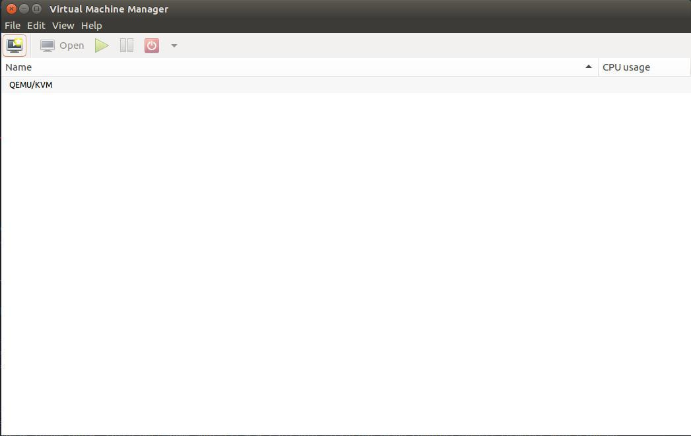
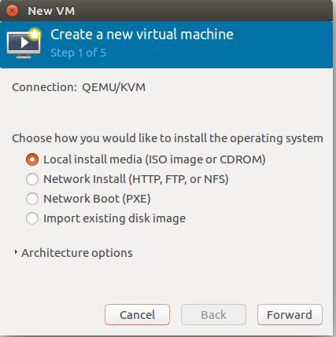
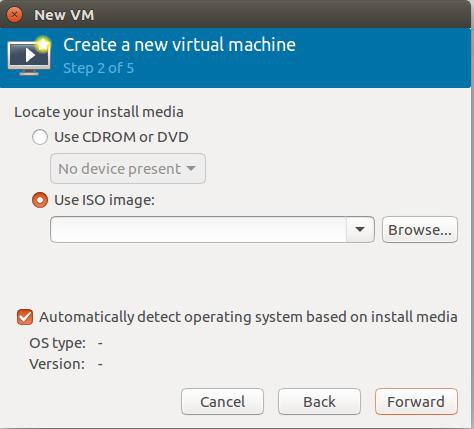
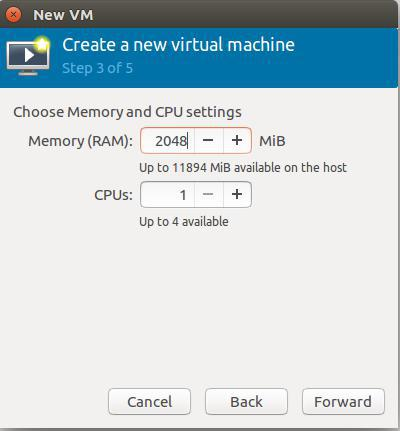
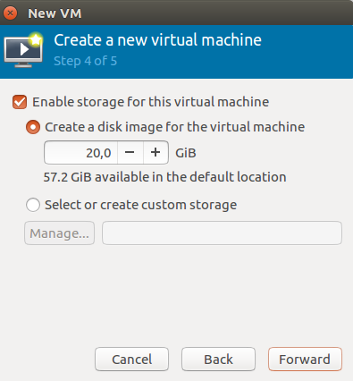
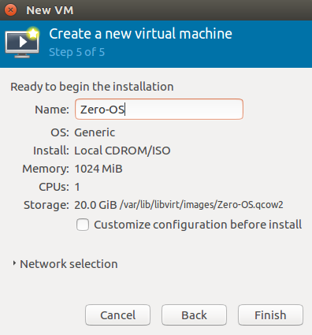

# Booting Zero-OS on a VM using QEMU

Follow below steps in order to boot a virtual machine with Zero-OS on a physical machine running Ubuntu using QEMU:

- [Install your machine](#configure-your-machine)
- [Install VM using the Terminal](#install-vm-using-the-terminal)
- [Install VM using the GUI](#install-vm-using-the-gui)
- [Ping Zero-OS](#ping-zero-os)

## Configure your machine

### Install QEMU and KVM

Install all required packages:
```shell
sudo apt-get update
sudo apt-get install qemu-kvm qemu libvirt-bin
```

After installing the above packages, reboot your system.

Check if your computer supports hardware virtualization (Intel VT) and whether it is enabled:
```shell
kvm-ok
```

If hardware virtualization is enabled, you should see something like:
```shell
INFO: /dev/kvm exists
KVM acceleration can be used
```

If hardware virtualization is not enabled you first have to enable it in the BIOS/UEFI settings.


### Configure the network bridge connection

We need to have a bridge to connect your virtual machine to your Ethernet network, typically you can use the default `virbr0`.

Check the state of existing networks:
```shell
sudo virsh net-list --all
```

If the state of the default network is **inactive**, activate it:
```shell
sudo virsh net-start default
```

> **NOTE**: If your WiFi card doesn't support bridging network connections, you have to connect the Ethernet cable.

By default the `qemu` directory and `bridge.conf` file are not created. In order to create them execute:
```shell
sudo mkdir /etc/qemu
sudo vi /etc/qemu/bridge.conf
```

Type the following on this file:
```shell
allow virbr0
```

## Install VM using the Terminal
### Get the Zero-OS kernel

Either build the kernel yourself as documented in [Building your Zero-OS Kernel](../building/README.md) or download it from the [Zero-OS Bootstrap Service](https://bootstrap.gig.tech/) as documented in [Zero-OS Bootstrap Service](../bootstrap/README.md).

We only require the kernel (`zero-os-master.efi`) file when booting with QEMU.


### Create the boot disk

Create an empty boot disk for the virtual machine:
```shell
qemu-img create -f qcow2 vda.qcow2 10G
```

> Note: Run this at any time when you want to wipe your boot disk.


### Start the virtual machine

```shell
ZEROTIER="<your_ZeroTier_network>"
sudo qemu-system-x86_64 -kernel staging/vmlinuz.efi -m 2048 -enable-kvm -cpu host -nographic -append "console=ttyS0,115200n8 zerotier=$ZEROTIER" -netdev bridge,id=virbr0,br=virbr0 -device virtio-net-pci,netdev=virbr0
```

## Install VM using the GUI

### Download the Zero-OS image

The easiest and recommended approach is to boot from an ISO image you get from the [Zero-OS Bootstrap Service](https://bootstrap.gig.tech/). You get an ISO boot image using `https://bootstrap.gig.tech/iso/{BRANCH}/{ZEROTIER-NETWORK}` where:

- **{BRANCH}** is the branch of the Zero-OS, e.g. `1.1.0-alpha`, or `zero-os-master`
- **{ZEROTIER-NETWORK}** is the ZeroTier network ID, create one on https://my.zerotier.com/network

See the [ISO section in the Zero-OS Bootstrap Service documentation](../bootstrap/bootstrap.md#iso) for more details on this.

Alternatively you can build your own boot image and create your own boot disk as documented in [Building your Zero-OS Boot Image](../building/building.md).

### Install Virtual Manager

```shell
sudo apt-get install virt-manager virt-viewer
```

### Start Virtual Manager

Open Virtual Manager using the terminal:
```shell
sudo virt-manager
```

### Create a new VM
You'll see a screen like the one below. Click on first button of the top menu to create a new virtual machine.



Keep the first option selected and click on Foward.




### Select the ISO file

Click the option "Use ISO image" and click on Browse... for select the path of the image you downloaded in the previous steps, and continue.




### Configure RAM memory and storage space
Set RAM to 2048 and click Forward.



Keep the first option selected and choose the capacity, e.g. `10GB`.




### Give a name to the VM
Type the name, e.g. `Zero-OS`, on the name field and click Finish. The virtual machine will start automatically.




## Ping Zero-OS

Using the Python client:

```python
from zeroos.core0.client import Client

cl = Client("<your_ZeroTier_network>")
cl.ping()
```
